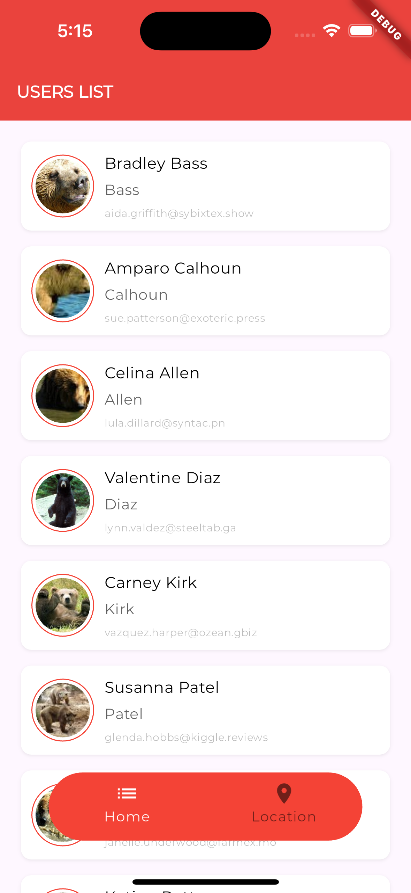
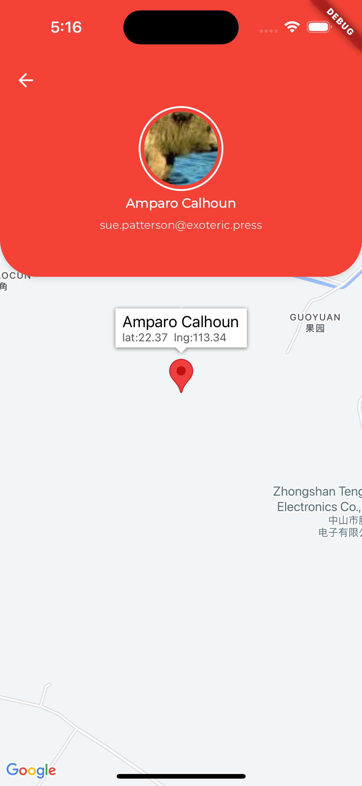
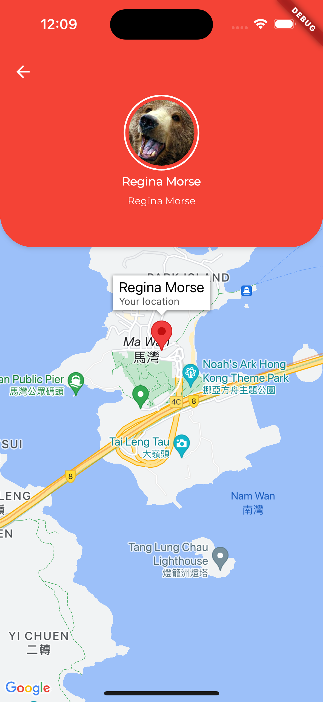

API Specification
Get list of people

Method GET
Endpoint https://api.json-generator.com/templates/-xdNcNKYtTFG/data
API Key (Bearer Token): b2atclr0nk1po45amg305meheqf4xrjt9a1bo410 (Don't worry. It is a public key. If it doesn't work, do let us know)
Fetch From API
curl --request GET -H "Authorization: Bearer R4iN..." --url https://api.json-generator.com/templates/tAu-9/data
User Requirements
Retrieve list of people from the API
Display list of people.
Show details when user select an item in the list.
Add marker on the map based on the provided latitude/longitude in location.
Display the person name on the marker when it is tapped.
Screenshots:

     
    
    
    

