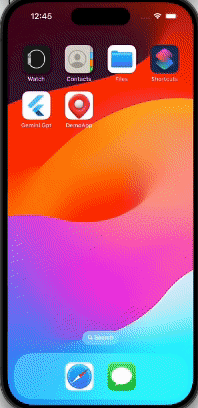

### API Specification

**Get list of people**
* Method
  `GET`
* Endpoint
  `https://api.json-generator.com/templates/-xdNcNKYtTFG/data`
* API Key (Bearer Token): `b2atclr0nk1po45amg305meheqf4xrjt9a1bo410` (Don't worry. It is a public key. If it doesn't work, do let us know)

### Fetch From API
```
 curl --request GET -H "Authorization: Bearer R4iN..." --url https://api.json-generator.com/templates/tAu-9/data
```

### User Requirements
- Retrieve list of people from the API
- Display list of people.
- Show details when user select an item in the list.
- Add marker on the map based on the provided latitude/longitude in `location`.
- Display the person name on the marker when it is tapped.
### Screenshots:
<div >

</div>
<div align="center">
     
    
    
    
</div>

## Setup instruction
##Get the Flutter Source Code:
If the app is hosted on a platform like GitHub, you'll need to download or "clone" the source code to your local computer.
You can do this by using a Git client or by downloading a ZIP file of the project.

## Set up your Coding Environment:
Open your coding app (Android Studio or Visual Studio Code) and make sure you have the Flutter and Dart plugins installed.
If prompted, you may need to configure your coding app to point to the location of your Flutter SDK.

## Open the Flutter Project:
In your coding app, find the option to "Open" or "Import" a project.
Navigate to the folder where you downloaded or cloned the Flutter app's source code and select the project.

## Install Dependencies:
The existing app have some additional libraries or packages that need to be installed.
Look for a pubspec.yaml file in the project and make sure to run "flutter pub get" a command to download and install those dependencies.
## Set up Android Development (optional):
If the app is designed to run on Android devices, you'll need to have Android Studio and the Android SDK installed.
Make sure your coding app knows where the Android SDK is located by setting the ANDROID_HOME environment variable.
## Set up iOS Development (optional, if you have a Mac):
If the app is designed to run on iOS devices (iPhones or iPads), you'll need a Mac computer with Xcode installed.
You'll also need to have a valid Apple Developer account and configure your development team.
## Run the App:
Connect an Android or iOS device to your computer, or start an emulator.
In your coding app, look for a "Run" or "Debug" button and click it to launch the app on the connected device or emulator.
## Google map setup
Refer to this page https://developers.google.com/maps/flutter-package/config
Android: Add API Key to Android Manifest File
-Navigate to android > app > src > main > AndrodManifest.xml file and add the below code in the manifest tag. Make sure to add your Google Maps API key in the value.
<meta-data android:name="com.google.android.geo.API_KEY"
android:value="Enter your API key here"/>

IOS
-Navigate to ios/Runner/AppDelegate.swift
  - GMSServices.provideAPIKey("YOUR-KEY") 
- In info.plist file
  - <key>io.flutter.embedded_views_preview</key>
  -  <true/>
  -  <key>NSLocationWhenInUseUsageDescription</key>
  -  <string>This app needs access to location when open.</string>
  -  <key>NSLocationAlwaysAndWhenInUseUsageDescription</key>
  -  <string>This app needs access to location when in the background.</string>
  -  <key>NSLocationAlwaysUsageDescription</key>
  -  <string>This app needs access to location when in the background.</string>
  -  <key>NSContactsUsageDescription</key>
  -  <string>This app needs access to contacts to show them on the map.</string>
  -  <key>NSPhotoLibraryUsageDescription</key>
  -  <string>This app needs access to photos to show them on the map.</string>
  -  <key>NSCameraUsageDescription</key>
  -  <string>This app needs access to the camera to show photos on the map.</string>

## Google map key
  - you can use get your own key from google cloud
## Testing 
  - two test cases for getting number users success and failure case using mockito
  - for testing testcases -Run following command inside project folder "flutter pub  run build_runner build"


